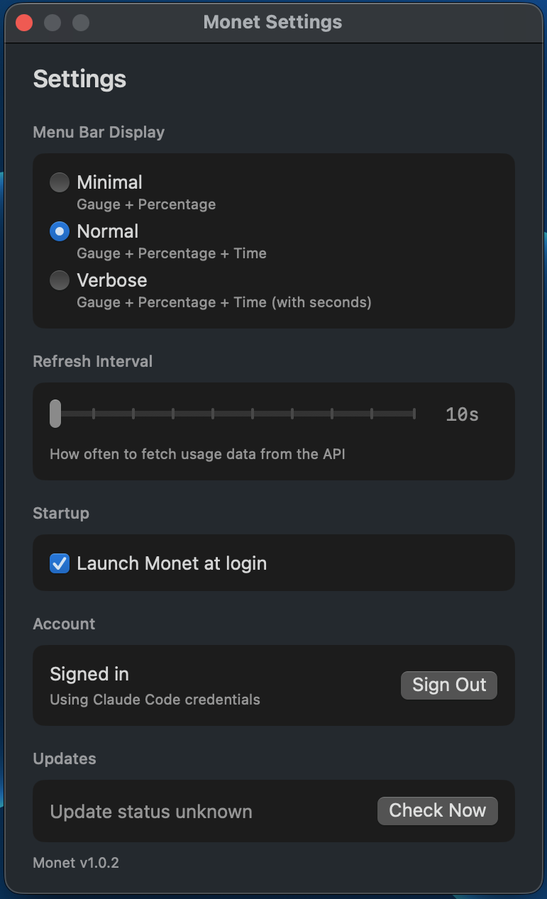

<p align="center">
  
</p>

<h1 align="center">Monet</h1>

<p align="center">
  A lightweight macOS menu bar app for monitoring your Claude API usage in real-time.
</p>

<p align="center">
  
  
  
  
</p>

<p align="center">
  
  &nbsp;&nbsp;&nbsp;&nbsp;
  
</p>

## Features

- **Real-time Usage Tracking** — Monitor 5-hour session limits and 7-day rolling usage
- **Model Breakdown** — See separate usage for Opus and Sonnet models
- **Menu Bar Integration** — Circular progress gauge with percentage and countdown timer
- **Multiple Display Modes** — Minimal, Normal, or Verbose information density
- **Auto-Updates** — Built-in update checker for new releases
- **Secure** — OAuth 2.0 with PKCE, credentials stored in macOS Keychain

## Installation

### Download

1. Download the latest `Monet-x.x.x.dmg` from [Releases](../../releases/latest)
2. Open the DMG and drag Monet to Applications
3. **Important — First launch only:**
   ```bash
   xattr -cr /Applications/Monet.app
   ```
   This removes the macOS quarantine flag (the app is unsigned but safe).
4. Launch Monet from Applications

> **Alternative:** Right-click Monet.app → "Open" → click "Open" in the dialog.

### Build from Source

```bash
git clone https://github.com/MuGMaN/Monet.git
cd Monet
open Monet.xcodeproj
# Build and run with Cmd+R
```

Requires Xcode 15+ and macOS 14+.

## Authentication

Monet supports two authentication methods:

| Method | Description |
|--------|-------------|
| **Claude Code** | Automatically uses existing Claude Code credentials if installed |
| **OAuth** | Sign in via Settings if Claude Code is not available |

## Usage

| Display Mode | Menu Bar Shows |
|--------------|----------------|
| Minimal | `◐ 32%` |
| Normal | `◐ 32% 2:11` |
| Verbose | `◐ 32% 2:11:45` |

**Color Indicators:**
- 🔵 Blue — Under 75% usage
- 🟠 Orange — 75-89% usage
- 🔴 Red — 90%+ usage (approaching limit)

## Configuration

Access Settings from the menu bar dropdown:

- **Display Mode** — Choose information density
- **Refresh Interval** — 10 seconds to 5 minutes
- **Launch at Login** — Start automatically with macOS

## Requirements

- macOS 14.0 (Sonoma) or later
- Active Claude Pro/Team subscription

## Contributing

Contributions are welcome! Please read the [Contributing Guidelines](CONTRIBUTING.md) before submitting a PR.

## Privacy

- No data collection or telemetry
- Credentials stored locally in macOS Keychain
- Only communicates with `api.anthropic.com` and `github.com` (for updates)

## License

MIT License — see [LICENSE](LICENSE) for details.

---

<p align="center">
  <sub>Built for Claude power users who want to stay within their limits.</sub>
</p>
